PEOPLE-WARE: RECRUITING WEBAPP

TABLE OF CONTENTS\
	<pre> INTRODUCTION	</pre>
	<pre> SPECIFICATIONS	</pre>
	<pre> SOFTWARES REQUIRED	</pre>
	<pre> SOURCE CODE	</pre>
	<pre> INSTALLATION NOTES	</pre>
	<pre> ABOUT THE APPLICATION	</pre>
	<pre> CLASS DIAGRAMS	</pre>

INTRODUCTION\
	The company PEOPLE-WARE is dedicated to recruit personnel. They want to automate the selection process of candidates for the job offers requested by other companies (i.e. its clients). The selection should be based on the skills and academic degrees of the applicants. For this, it is needed to maintain the information of the applicants searching for a job and the job offers from the companies searching for candidates. 

SPECIFICATIONS\
	<pre>When a company wants to subscribes to the PEOPLE-WARE web app, the following information is requested:</pre>
		<ul>
		<li> Company name</li>
		<li> Username</li>
		<li> Password</li>
		</ul>
	<pre>When a company wants to post a job offer, the following information should be provided:</pre>
	<ul>
	<li> Name and description of the job position: For example: “Software Developer” and “Java developer with insights in the latest trends of web development”</li>
	<li> Salary (in CAD)</li>
	<li> Working time: Full-time or Part-time</li>
	<li> Job Requirements:</li>
	</ul>
			<pre>Mandatory fields:</pre>
		<ul>
		<li> Academic degree(s)</li>
		<li> Job offer must have at least one skill</li>
		<li> Technical skills, each with the minimum required level that is expressed with a scale from 1 to 5 (low to high). </li>
	</ul>
	<pre>When an applicant subscribes to the PEOPLE-WARE web app, the following information is requested:</pre>
		<ul>
		<li> Full name</li>
		<li> Username</li>
		<li> Password</li>
	</ul>
	<pre>When an applicant applies for a posted job, the following information is requested:</pre>
			<ul>
				<li> Full name</li>
				<li> Email</li>
				<li> Contact Number</li>
				<li> Salary</li>
			</ul>
			<pre> Mandatory fields:	Academic Degree(s) and Technical Skills</pre>
	<pre>The web application should select the applicants that qualify for each job offer, based on the following rules:</pre>
		<ul>
			<li> Display the eligible applicant(s) Full name, Email and Contact</li>
			<li> Salary within the salary range of the job offer </li>
		</ul>
			<pre> Mandatory fields:</pre>
		<ul>
			<li> Academic Degree(s)</li>
			<li> Technical skills: defined using the scale (1-5). At least one skill must be specified </li>
		</ul>
		
SOFTWARES REQUIRED\
	The software that are needed for the application to be edited or executed 
	<ul>
	<li> ‘backend’ --> Java and Spring Boot.</li>
	<li> ‘frontend’ --> Angular (2/4/6), Node, Express, Bootstrap.</li>
	<li> database --> MySQL.</li>
	</ul>

SOURCE CODE\
	The Source code for the application is in the ‘recruitingApp’ folder
	<ul>
	<li> ‘backend’ --> This folder has the source code for the API.</li>
	<li>‘frontend’ --> This folder has the source code for the Front User Interface.</li>
	<li> ‘scripts’ --> This folder has a ‘recruitingAppScripts.sql’ file for the Database table creations.</li>
	</ul>

INSTALLATION NOTES\
	All the execution of this application will be done via command prompt terminal
<ol type="A">
	<li> Database </li>
	<ol type="i">
		<li> Open the SQL workbench and import the ‘recruitingApp_Scripts.sql’ file from the ‘scripts’ folder.</li>
		<li> Edit the name of the Database if you wish. Run the script in your workbench terminal.</li>
		<li> This will create a new Database by ‘localDb’ name with 4 tables namely ‘users’, ‘jobs’, ‘requirements’ and ‘applicants’.</li>
	</ol>
	<li> ‘backend’ </li>
	<ol type="i">
		<li>Import the project ‘recruitingApp’ into the IDE and open the ‘application.properties’ in the ‘com/java/resources/’ location.</li>
		<ol type="a">
		<li>Edit ‘spring.datasource.username’ and ‘spring.datasource.password’ attributes. If you have changed the name of the database then replace ‘localDb’ with the name of your database in ‘spring.datasource.url’ attribute. Then Save it. </li>
		</ol>
		<li>Open a terminal and navigate to the ‘recruitingApp’ folder using the command:	cd yourpath/recruitingApp</li>
		<li>Once inside the ‘recruitingApp’ folder, run the command: mvn clean install</li>
		<li>This will install all the required softwares. Then enter into the ‘backend’ folder using: cd backend</li>
		<li> Then execute the command: mvn spring-boot:run</li>
		<li>This will start the java files that possess the logic for the whole application to function.</li>
		<li>The code listens on port 9090 by default. If you wish to change, then you can do it in the ‘application.properties’ file.</li>
	</ol>
<li> ‘frontend’ </li>
	<ol type="i">
		<li>Open another Terminal window and navigate into the ‘frontend’ folder using the command: cd yourpath/recruitingApp/frontend/src/main/frontend/</li>
		<li>Then type npm start or yarn start to start the front end of the application.</li>
		<li>The User Interface runs on port 4500 by Default. </li>
	</ol>
	</ol>

ABOUT THE APPLICATION\
	This application can be accessed by visiting the url ‘http:localhost:4500/’ after you have installed and initiated the step given in the ‘INSTALLATION NOTES’ section.
The application data cannot be preloaded as it makes use of the logged in Session user information to store and retrieve information from the database. The application begins at the page displayed in screen shown in Figure 1. 

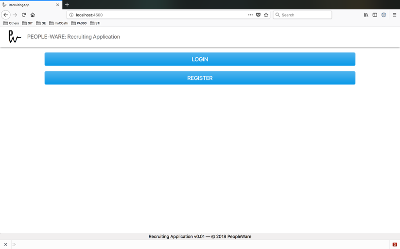	

	Figure 1: Start-up screen of UI

The new user has to Register himself either by playing the role of a Company or an Applicant. The Username and Password are encrypted using a simple Base64 conversion and then stored into the database. When a user attempts to log-in, this value is retrieved and decrypted to get the actual string and then the values are validated.
	
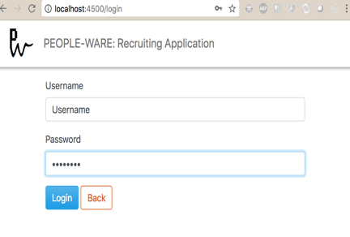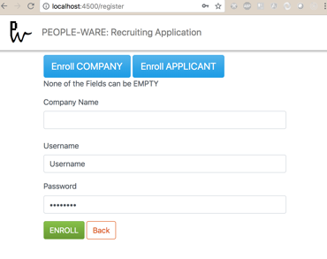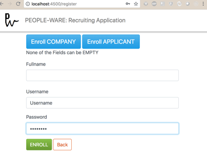	

	Figure 2: [From left to right] Login, Register(Company) and Register(Applicant) Screens.

Once the user is Validated then he is redirected to either the Company Dashboard or the Applicant Dashboard based on the information stored at Registration.
	If the user was registered as an Applicant then, the user sees a dropdown menu (Figure 3) on the screen where he can choose the desired job from the list of all the available jobs. Upon selection, the user is transferred to another screen which has the job-related information (Figure 4). The User can fill the details and click on ‘Apply’ button or choose to close (Figure 4). If there are any unfulfilled fields, the error message is either displayed in the Status Bar at the bottom of the field or at the bottom or the screen (Figure 3).
	
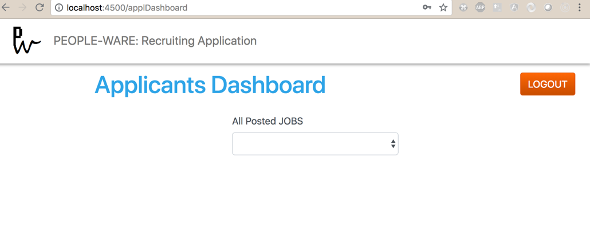 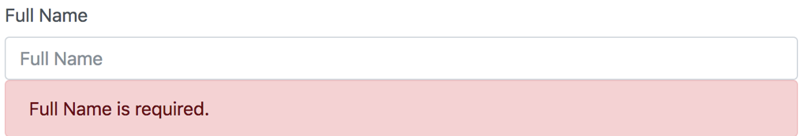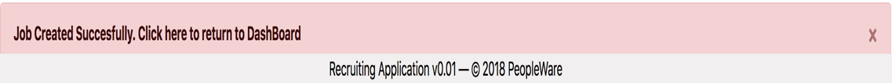

	Figure 3: [From left to right] Applicant Dashboard, Status Message at Field, Status Message at the Bottom of screen

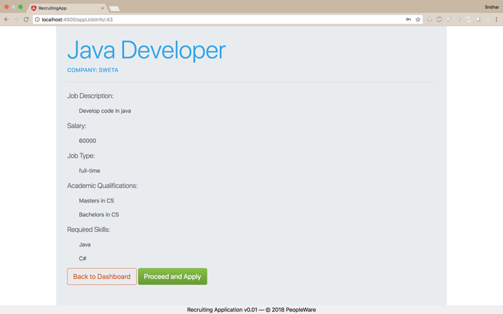 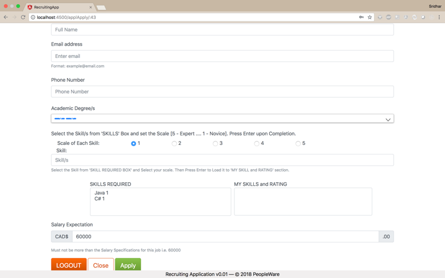	

	Figure 4:[From left to right] Job-Info Screen, Job-Apply Screen

<pre>If the user was registered as being associated to a company then, there are three options to choose from (Figure 5)</pre>
	<ul>
	<li>SEE ALL THE APPLICANTS</li>
	<li>POST A NEW JOB</li>
	<li>EDIT AN EXISTING JOB</li>
	</ul>\
The user can Post a new based on the conditions mentioned in the ‘REQUIREMENTS’ section. If all the conditions are met, then the Job is inserted into the database. To enter the skills and academic degrees, the user must first enter the values and press the ‘Return’/’ENTER’ key. This pushes the values into a box which will be added as qualifications for the job. 
The main edit screen has a dropdown which gets populated with the list of all the jobs this user has posted. To edit an existing, the actions remain similar to that of posting a job but here the user cannot edit the Name and Description of the Job. Here when the user clicks on the ‘X’ button on the ‘Academic Degrees’ and ‘Skills’ boxes, it clears the entries and user can fill in new information again. This box will not be available unless one entry is made into it.

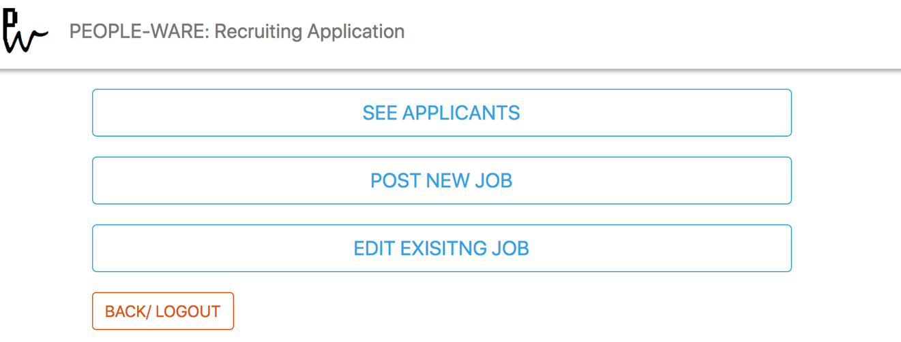

	Figure 5: Dash-Board of the User registered on behalf of a company.
	
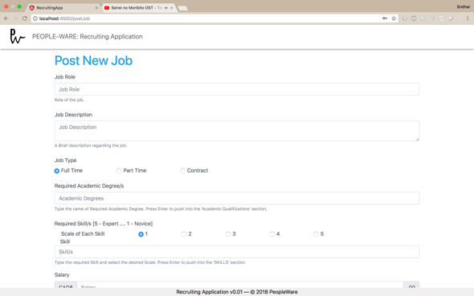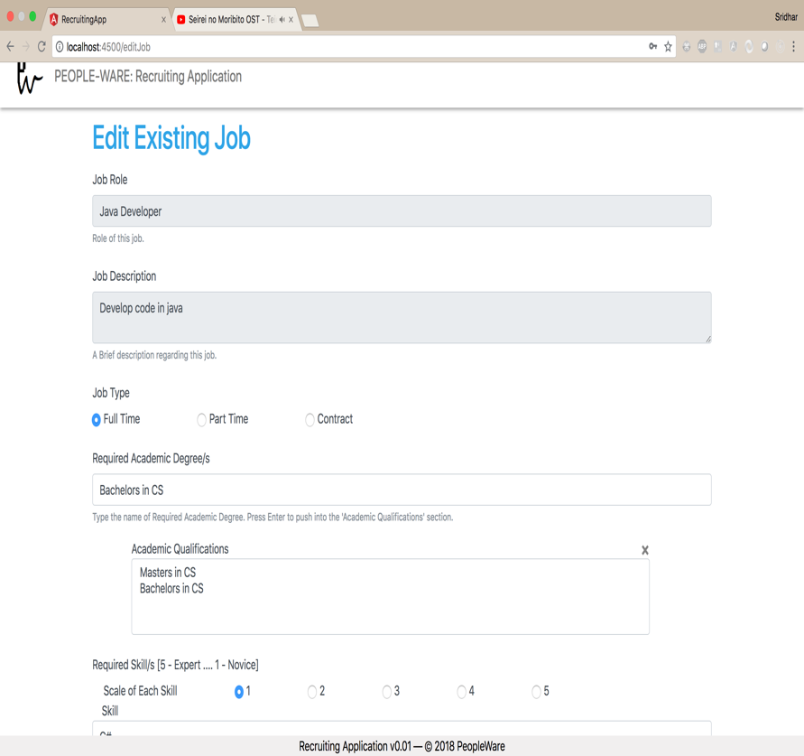	

	Figure 6:[From left to right] Post Job Screen and Qualification box with X mark
	
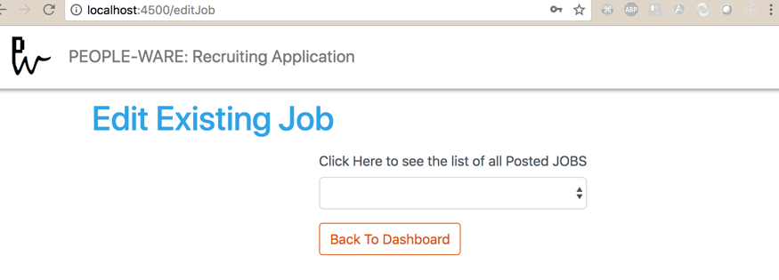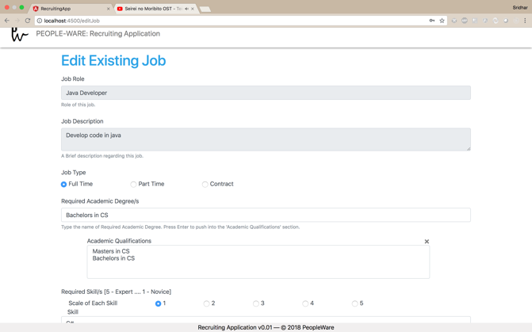	

	Figure 7:[From left to right] Edit screen dropdown, Edit Job Screen

The ‘SEE ALL APPLICANTS’ screen also begins with a dropdown which is populated with the jobs this user has posted. Upon selecting the job, the screen gets loaded with the list of all the eligible applicants. 
The Eligibility criteria is such that it rates the applicants based on the total sum of the scales of all the skills the applicant has which matches with the skills required for the job. If the applicant had fed a skill which is not mentioned in the job requirement, then the scale of that particular skill is ignored and not taken into consideration during the calculation of the total scale. The eligible applicant list is sorted in descending order i.e. applicant with the maximum scale on top followed by lower ones.

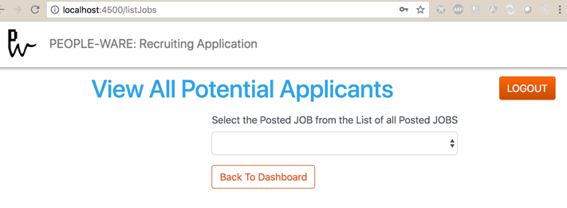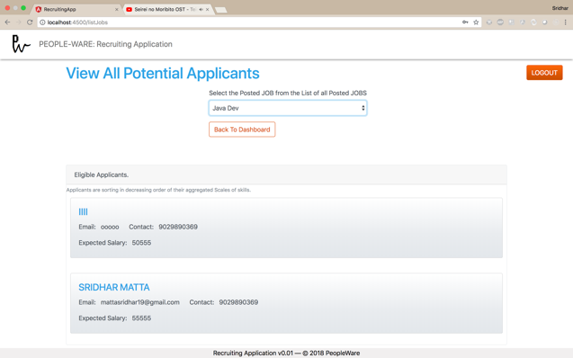	

	Figure 8:[From left to right] Dropdown to list all the job and Screen with eligible applicants

When the User hits the LOGOUT button, all the session information is cleared, and the user is redirected to the Main screen (Figure 1).

CLASS DIAGRAMS\
	All the class diagrams are located in the ‘classDiagrams’ folder within the ‘recruitingApp’ folder. The class diagrams for User, Applicant, Company-Posting/Edit/Retrieval Jobs and Eligible Applicants are Figures 9 through 12 respectively.
	
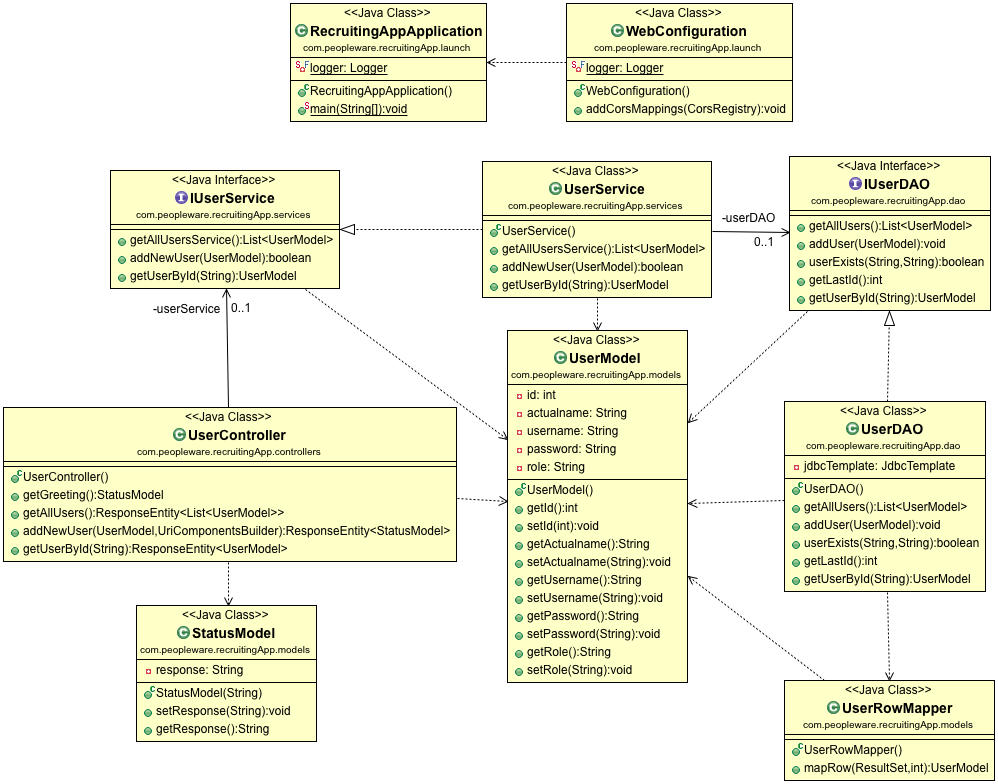	

	Figure 9: Class Diagram for User
	
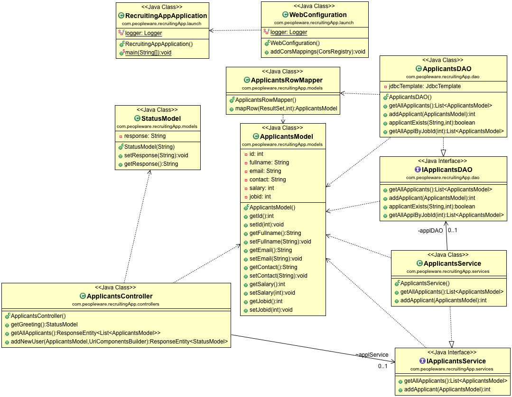	

	Figure 10: Class Diagram for Applicant
	
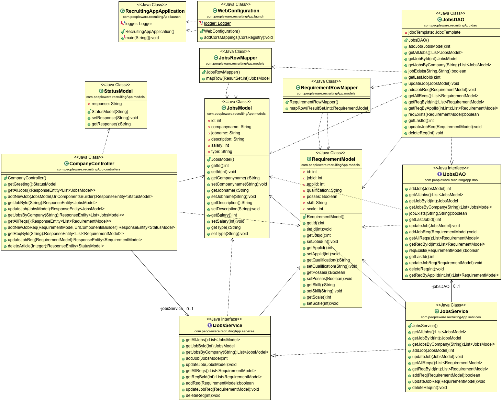	

	Figure 11: Class Diagram for Company-Posting/Edit/Retrieval Jobs
	
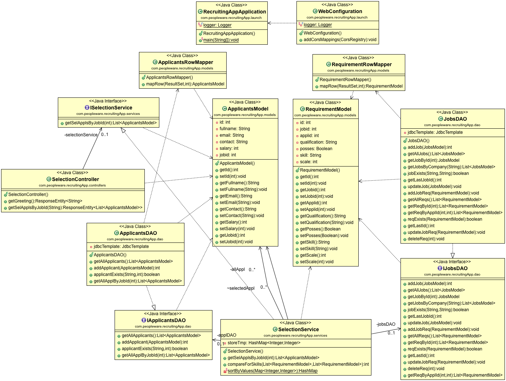

	Figure 12: Class Diagram for Returning Eligible Applicants

